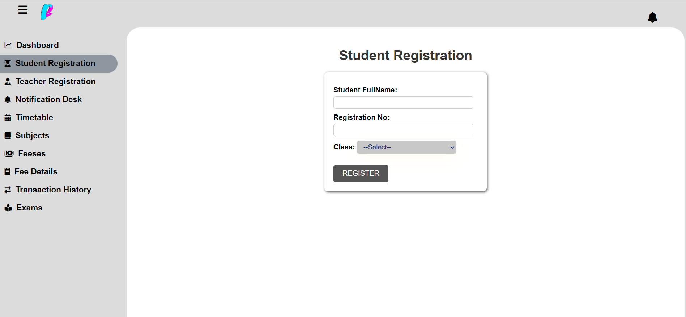
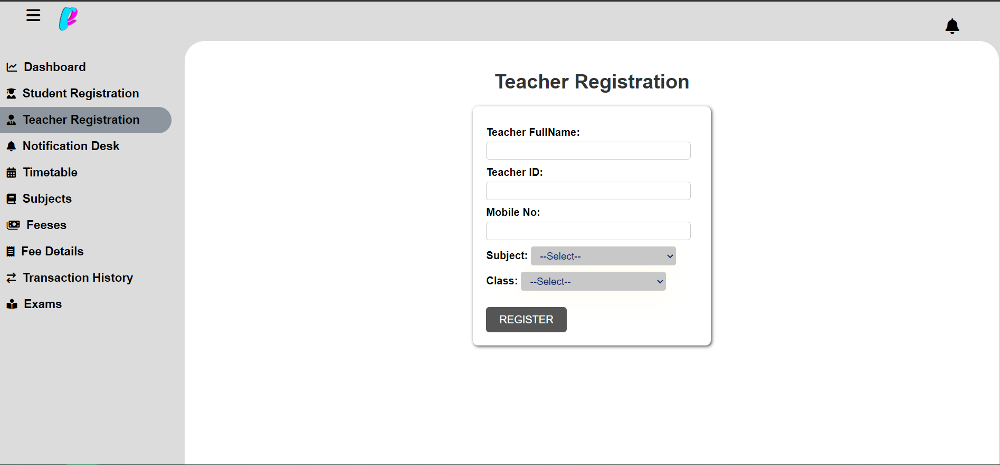
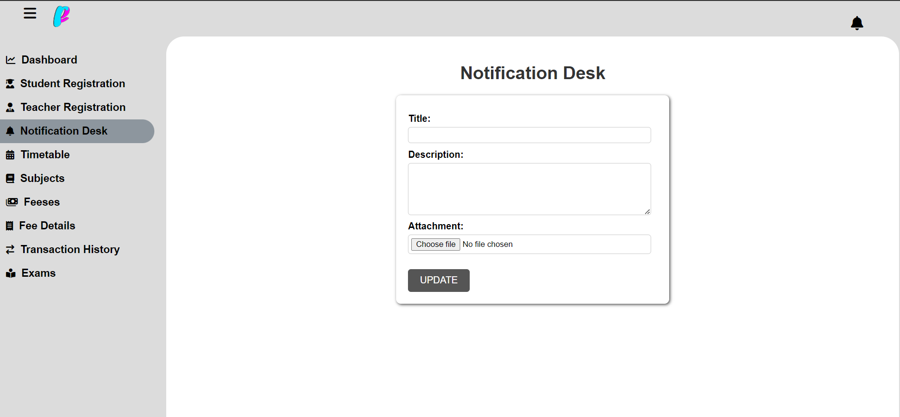
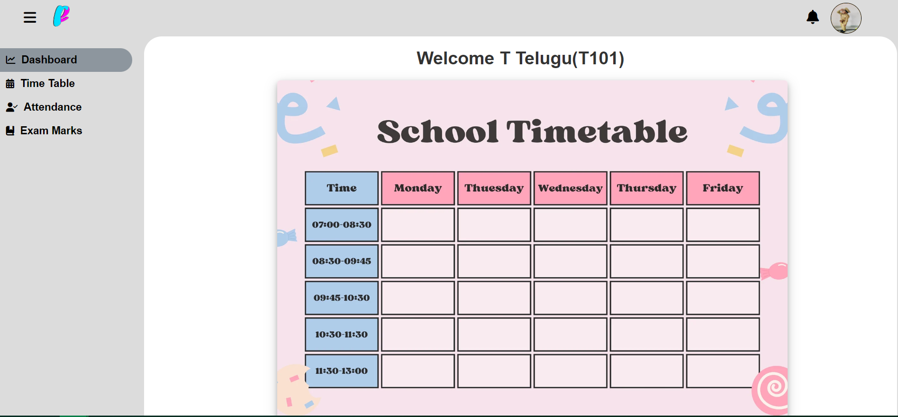
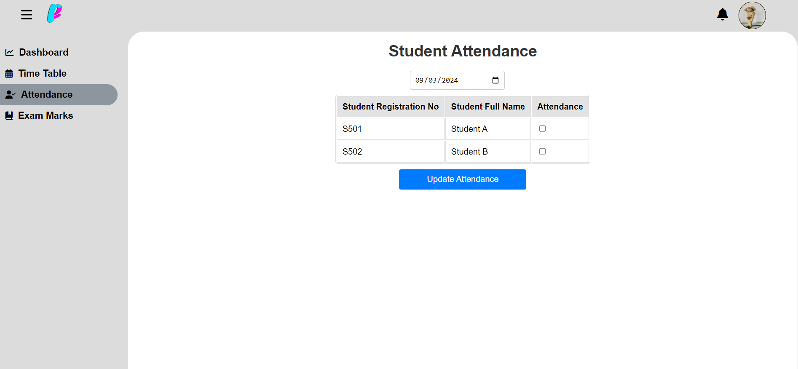
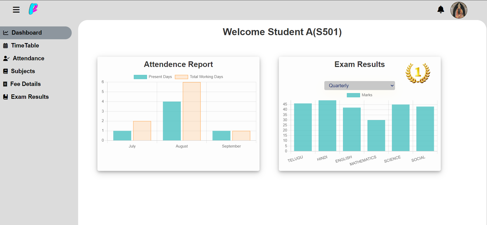

# EduSmart-School-Management-System
## Description
The **School Management System** is a comprehensive web application built using Django, designed to streamline administrative tasks and enhance communication within educational institutions. The system provides three distinct user roles—Admin, Teacher, and Student—each with tailored functionalities:
- **Admin Dashboard**: Manage student and teacher registrations, upload and manage notifications, handle class timetables, oversee subjects and fees, and administer exams.
- **Teacher Portal**: Access timetables, record student attendance, and input exam marks.
- **Student Portal**: View attendance and marks in graphical formats, access personal timetables, check attendance details, view subjects and fee details, and review exam results.

### Admin Dashboard

## Table of Contents

- [Project Overview](#project-overview)
- [Features](#features)
  - [Admin Features](#admin-features)
  - [Teacher Features](#teacher-features)
  - [Student Features](#student-features)
- [Screenshots](#screenshots)
- [Technologies Used](#technologies-used)
- [Contact Information](#contact-information)

## Project Overview
  
The School Management System aims to streamline various administrative and academic processes in schools. By providing distinct portals for admins, teachers, and students, the system enhances efficiency and transparency.

## Features

### Admin Features
- **Student & Teacher Registration**: Register and manage student and teacher accounts.
- **Notification Desk**: Upload notifications like circulars, exam results, and announcements.
- **Timetable Management**: Upload, view, and delete timetables for each class.
- **Subject Management**: View and edit subjects for each class.
- **Fee Management**: Set default fees for each class and manage individual student fees.
- **Exam Management**: Create exams, set max marks, and control result access.

#### Admin Registration

#### Notification Desk

### Teacher Features
- **Dashboard**: View personal timetable uploaded by the admin.
- **Timetable Section**: View timetables for all classes via a dropdown.
- **Attendance Section**: Mark attendance for students in their respective classes.
- **Exam Marks Section**: Enter and manage marks for the subjects they teach.

#### Teacher Dashboard

#### Attendance Section

### Student Features
- **Dashboard**: View attendance and marks in graphical formats.
- **Timetable Section**: View the timetable for their class.
- **Attendance Section**: Select a date range to see attendance details, working days, and percentage.
- **Subjects Section**: View the subjects for their class.
- **Fee Details Section**: View fee details and transaction history.
- **Exam Results Section**: View exam results based on admin access.
- **Profile Section**: View and update their profile information.

### Student Dashboard

## Screenshots

### Admin Dashboard
The Admin Dashboard allows the admin to manage various aspects of the school, including student and teacher registrations, notifications, timetables, subjects, fees, and exams.

### Teacher Portal
Teachers can access their personal dashboard, view timetables, mark attendance, and manage exam marks through the Teacher Portal.

### Student Dashboard
The Student Dashboard provides students with an overview of their attendance, marks, and timetable. Students can also access their fee details, exam results, and personal profile.

## Technologies Used

This project utilizes a variety of technologies to deliver a comprehensive and efficient School Management System:

### Backend
- **Django**: A high-level Python web framework that enables rapid development and clean, pragmatic design.
- **SQLite3**: A lightweight, disk-based database that doesn’t require a separate server process, perfect for development and small-scale deployments.

### Frontend
- **HTML5**: Markup language for structuring content on the web.
- **CSS3**: Used for styling the application, ensuring a responsive and visually appealing interface.
- **JavaScript**: Adds interactivity and dynamic content updates to the web pages.
- **Bootstrap**: A powerful front-end framework for developing responsive, mobile-first websites.

### Data Visualization
- **Chart.js**: A JavaScript library used to create simple yet flexible charting for the graphical representation of attendance and marks.

## Contact Information
- **Email**: [vadlarohith132@gmail.com](mailto:vadlarohith1352@gmail.com)
- **Github**: [vadlarohith](https://github.com/vadlarohith)
- **LinkedIn**: [rohithvadla](https://www.linkedin.com/in/rohithvadla/)
